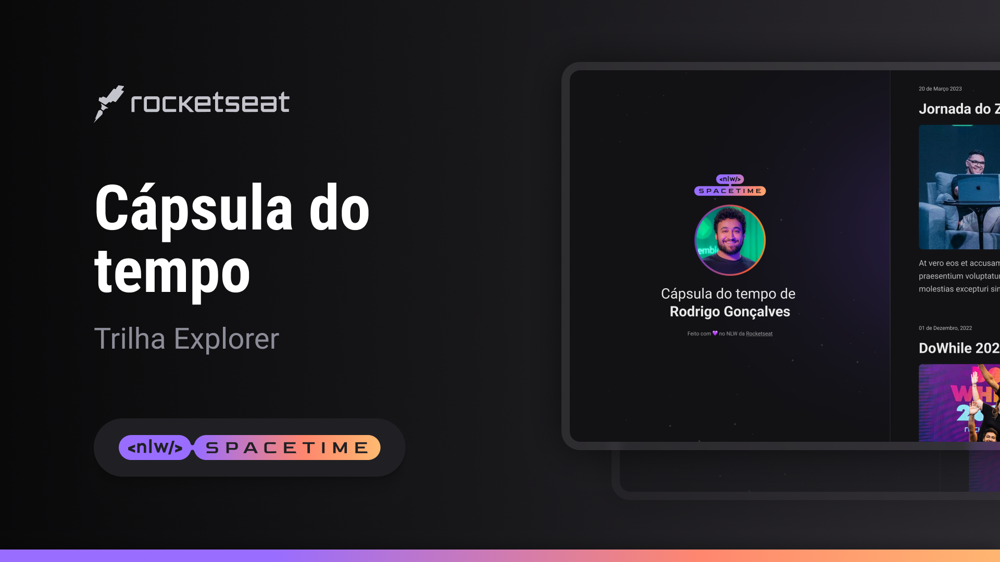

  

## 💻 Projeto
Esse é um projeto responsivo de uma cápsula do tempo para exibir memórias em uma timeline.

## 🚀 Tecnologias
Esse projeto foi desenvolvido durante o NLW da Rocketseat

- HTML
- CSS
- Git e Github

## 🏷 Layout
Você pode visualizar o layout do projeto através [desse link](https://www.figma.com/@enzocarvtech).
É necessário ter uma conta no [Figma](https://www.figma.com)